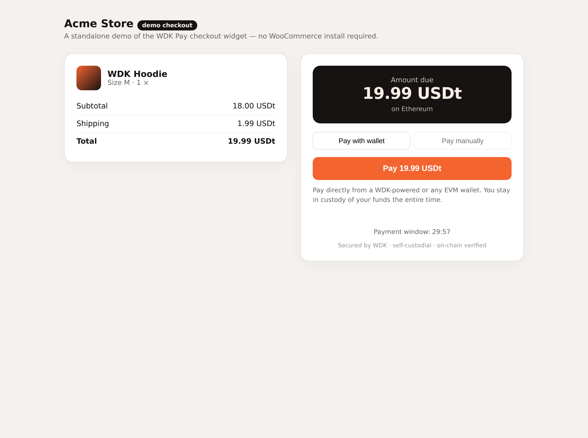
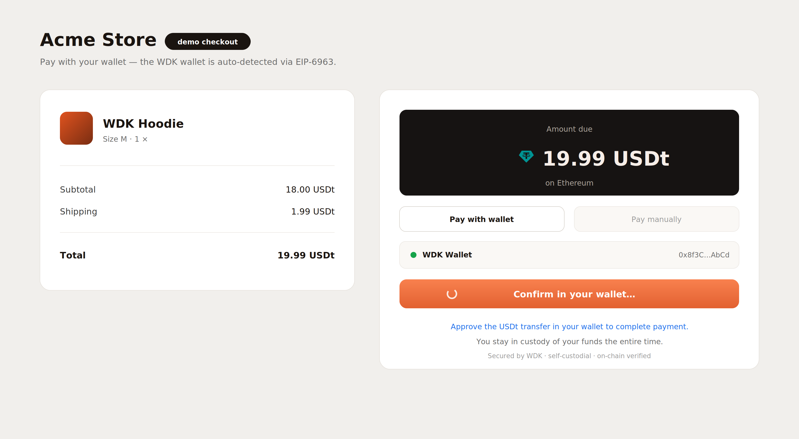
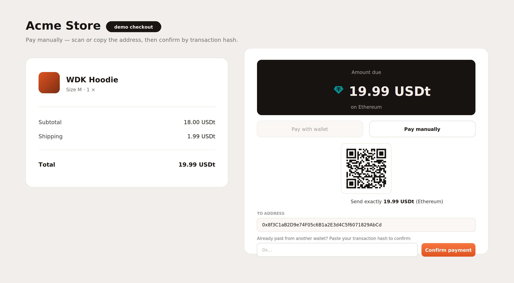

<div align="center">


# WDK Pay — Self-Custodial USDt Checkout for WooCommerce

**Accept USDt payments in WooCommerce, paid directly from a self-custodial [WDK](https://docs.wallet.tether.io) wallet — no custodian, no payment processor, no middleman.**

Reference implementation for the Tether WDK **WDK in Ecommerce** bounty.

[](./LICENSE)
[](#the-woocommerce-plugin)
[](#how-it-works)

</div>

---

## Why this exists

Merchants who want to accept stablecoins face a fragmented mess: custodial processors that hold their funds, closed gateways, and tooling that demands deep blockchain expertise. There has been **no reference implementation** showing how WDK can power a real ecommerce checkout.

This is that reference. It turns any WooCommerce store into a **self-custodial USDt checkout**: the customer pays from their own WDK-powered wallet, the funds land **directly in the merchant's wallet**, and the plugin **verifies the payment on-chain** before completing the order. No one ever custodies the money but the two parties to the trade.

## What's in the box

| Component | What it is |
|---|---|
| **`woocommerce-plugin/wdk-pay/`** | A complete WooCommerce **payment gateway plugin** (PHP): admin settings, the "Pay with USDt/XAUt" gateway, REST endpoints, and on-chain payment verification. |
| **`packages/wdk-checkout/`** | A headless, **themeable** **checkout widget / SDK** (TypeScript): connect a wallet and pay, or pay manually and confirm by tx hash. Builds to a single asset the plugin loads. |
| **`packages/wdk-checkout/x402`** | An **x402 facilitator** (TypeScript): verify per-request payments from bots/agents off-chain. |
| **`examples/`** | A **Cloudflare Worker** + **Express middleware** that charge AI crawlers via x402 (humans + search engines pass free). |
| **`docs/`** | Platform-selection rationale & architecture (the M1 deliverable), merchant setup, security model, and the demo script. |

## How it works

```
 Customer (self-custodial WDK wallet)            WooCommerce store
 ───────────────────────────────────             ─────────────────
        │  1. checkout → "Pay with USDt"                │
        │ ◄─────────────────────────────────────────────┤ 2. order created (pending)
        │                                                │    + payment intent
        │  3. wdk-checkout widget:                       │
        │     connect wallet · USDt.transfer(merchant)   │
        │ ───────── on-chain USDt transfer ──────────►   │  (funds go straight to merchant)
        │                                                │
        │  4. POST tx hash ─────────────────────────────►│ 5. verify on-chain (JSON-RPC):
        │                                                │    Transfer(to=merchant, value≥due)?
        │ ◄────────── 6. order complete ✓ ───────────────┤    confirmations ok?
```

The payment is a **direct, peer-to-peer ERC-20 transfer**. The plugin never touches the funds — it only *observes* the chain to confirm the order. That is what "self-custodial checkout" means.

### Optional: gasless payments (EIP-3009)

For customers with no native gas token, the checkout can use **EIP-3009 `transferWithAuthorization`**: the customer *signs* a transfer (free), and the merchant's relayer submits it and pays gas. That path is implemented by the companion module **[`wdk-protocol-eip3009`](https://github.com/plinkdev1/wdk-protocol-eip3009)** — see [`docs/ARCHITECTURE.md`](./docs/ARCHITECTURE.md#gasless).

## Screenshots

| Checkout (storefront + widget) | Pay with wallet | Pay manually (QR) |
|:--:|:--:|:--:|
|  |  |  |

**▶ Demo video:** [`media/demo/wdk-pay-checkout-demo.webm`](./media/demo/wdk-pay-checkout-demo.webm) (use **Download**/**Raw** on GitHub). The shot-by-shot script is in [`docs/DEMO.md`](./docs/DEMO.md).

> Try it yourself with **zero setup**: open [`examples/checkout-demo.html`](./examples/checkout-demo.html) in a browser — it runs the real widget against a sample payment intent. Screenshots above are captured from that page via headless Chromium.

## Supported networks & asset

USDt on **Ethereum**, **Polygon**, and **Arbitrum** out of the box (default token addresses bundled). Adding a chain is one entry in `WDK_Pay_Chains`.

## The WooCommerce plugin

```
woocommerce-plugin/wdk-pay/
├── wdk-pay.php                     # plugin bootstrap
├── includes/
│   ├── class-wdk-pay-gateway.php   # WC_Payment_Gateway: settings, process_payment, order-pay page
│   ├── class-wdk-pay-rest.php      # REST: POST /confirm, GET /status
│   ├── class-wdk-pay-verifier.php  # on-chain verification via JSON-RPC
│   ├── class-wdk-pay-chains.php    # chains + default USDt addresses
│   └── class-wdk-pay-intent.php    # builds the payment intent
└── assets/js/wdk-checkout.js       # the built checkout widget
```

Install it like any WooCommerce plugin and configure your receiving address, chain, and RPC URL. Full steps: [`docs/MERCHANT_SETUP.md`](./docs/MERCHANT_SETUP.md).

## The checkout widget

```bash
cd packages/wdk-checkout
npm install
npm run build          # builds dist/ (the SDK) and the plugin's wdk-checkout.js asset
```

The widget is framework-free, self-contained, and exposes a small SDK (`mountCheckout`, `payIntent`, …) so it can be embedded in any storefront, not just WooCommerce.

## Customization — match your storefront

The widget is **fully themeable** via a `CheckoutTheme` palette (no source edits).
Pass a `theme` to `mountCheckout` — any subset of keys overrides the WDK default
(warm dark surface + orange accent); the palette is injected as CSS variables so
it re-skins the entire widget:

```ts
import { mountCheckout } from 'wdk-checkout';

mountCheckout(root, {
  ...config,
  theme: { accent: '#0D9488', surface: '#0B1F1C', onSurface: '#E6FFFA', radius: '10px' },
});
```

Keys: `surface · onSurface · text · textMuted · textFaint · accent · accentText ·
border · info · success · error · radius · fontFamily` (see `DEFAULT_CHECKOUT_THEME`).

**No code needed for WooCommerce.** The gateway admin (**WooCommerce → Settings →
Payments → WDK Pay → Checkout appearance**) exposes native color pickers for the
**accent / button**, **accent text**, **surface (card)**, and **surface text**
colors, plus a **corner style** (sharp / soft / rounded / pill). The plugin maps
those to a `CheckoutTheme` partial and hands it to the widget as `WDK_PAY.theme`,
so a merchant re-skins the checkout to match their storefront entirely from the
admin — leave a color blank to keep the WDK default. The rest of the merchant
payment settings (method title/description, chain, **asset USDt/XAUt**, RPC,
confirmations, window) live in the same admin screen.

## x402 — charge bots, crawlers & AI agents

This repo also ships the **server side of [x402](#)** — monetize automated
traffic per request:

- **`wdk-checkout/x402`** — a full facilitator: `buildPaymentRequirements` /
  `buildPaymentRequiredResponse` (the 402 challenge), `decodePaymentHeader`,
  `verifyExactPayment` (recovers the EIP-3009 signer off-chain — no keys, no RPC,
  edge-safe), and `settleExactPayment` (submits the authorization on-chain via a
  relayer, so the payer pays gaslessly — the optional verify→settle loop).
- **`examples/cloudflare-x402-worker.js`** — a reverse proxy for the
  Netlify-behind-Cloudflare case: humans + verified search engines pass through,
  AI scrapers get a 402 and pay; funds go straight to your address.
- **`examples/express-x402-middleware.js`** — the same as Express middleware.

x402's "exact" scheme is a signed EIP-3009 authorization, so the wallet
([extension](https://github.com/plinkdev1/wdk-wallet-extension)) produces the
payment and [wdk-protocol-eip3009](https://github.com/plinkdev1/wdk-protocol-eip3009)
settles it on-chain. See [`ROADMAP.md`](./ROADMAP.md).

## Quickstart (local)

1. A WordPress + WooCommerce store (e.g. via `wp-env` or a local stack).
2. Copy `woocommerce-plugin/wdk-pay/` into `wp-content/plugins/` and activate it.
3. **WooCommerce → Settings → Payments → WDK Pay**: set receiving address, chain, and RPC URL.
4. Place a test order, choose **Pay with USDt**, and pay from a WDK wallet on a testnet.

## Documentation

- [`docs/ARCHITECTURE.md`](./docs/ARCHITECTURE.md) — **M1**: platform selection, architecture, integration plan.
- [`docs/MERCHANT_SETUP.md`](./docs/MERCHANT_SETUP.md) — install & configure, end to end.
- [`docs/SECURITY.md`](./docs/SECURITY.md) — the self-custodial trust & verification model.
- [`docs/DEMO.md`](./docs/DEMO.md) — demo-video walkthrough.

## Roadmap

📍 **Full phased roadmap: [`ROADMAP.md`](./ROADMAP.md).** It shows what ships today
(self-custodial USDt checkout + on-chain verification + gasless EIP-3009) and
sequences multi-asset/multi-chain checkout, **Lightning (Spark) instant payments**,
fiat pricing, swap-to-settle, subscriptions/refunds, more platforms (Shopify,
Magento), and fiat on-ramp — against real, published `@tetherto/*` packages.

---

## License

[MIT](./LICENSE). Built with [Tether WDK](https://docs.wallet.tether.io). A community reference implementation submitted to the Tether WDK bounty program; not an official Tether product.
